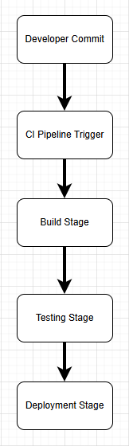

# CI/CD Workflow – Gym Management System

## 1. Overview of CI/CD

### Continuous Integration (CI)
Continuous Integration is the practice of frequently merging code changes into a shared repository and automatically running checks such as builds, tests, and code quality scans. The goal is to detect bugs early, prevent integration issues, and ensure the codebase is always in a working state.

### Continuous Deployment / Continuous Delivery (CD)
Continuous Delivery ensures that every change that passes automated tests is ready to be deployed at any time. Continuous Deployment goes one step further by automatically deploying every passing change directly to production without manual approval. Both approaches reduce release risk and speed up delivery.

### Importance of CI/CD
CI/CD is essential in modern software development because it automates repetitive tasks, reduces human error, and ensures consistent quality. It allows teams to deliver updates faster, catch bugs earlier, and maintain a stable, reliable application. CI/CD also supports collaboration by giving developers immediate feedback on their changes.

---

## 2. Proposed Pipeline Stages

Below is the conceptual CI/CD pipeline for the Gym Management System:

### **1. Developer Commits Code to GitHub**
A developer pushes new code or updates to the repository. This triggers the CI pipeline automatically.

### **2. CI Pipeline Trigger**
GitHub Actions (or another CI tool) detects the commit and starts the automated workflow.

### **3. Build Stage**
The system installs dependencies and prepares the environment.  
For this project, the build step includes:
- Installing Python
- Installing required packages
- Setting up the project structure

### **4. Automated Tests Run**
Unit tests and integration tests execute automatically.  
Examples:
- Testing Member.check_in()
- Testing ClassSchedule.enroll_member()

If any test fails, the pipeline stops and alerts the developer.

### **5. Code Quality Checks**
Tools such as Flake8, Black, or Pylint run to enforce coding standards.  
This ensures:
- PEP 8 compliance  
- No unused imports  
- No syntax errors  
- Consistent formatting  

### **6. Build Artifact Creation (Optional)**
If the system grows, the pipeline may package the application into a deployable artifact (e.g., Docker image).

### **7. Deployment to Staging Environment**
After passing all checks, the system deploys to a staging environment where:
- Trainers/admins can test features  
- QA can run manual tests  
- UAT can occur  

### **8. Manual Approval (Optional)**
An admin or instructor reviews the staging deployment and approves it for production.

### **9. Deployment to Production**
The final version is deployed to the live environment.  
This step may be automated (Continuous Deployment) or require approval (Continuous Delivery).

---

## 3. Tools That Could Be Used

Below are real tools that could support each stage of the pipeline:

| Stage | Example Tools | Purpose |

| Version Control | GitHub, GitLab | Stores code and tracks changes |
| CI Pipeline | GitHub Actions, Jenkins, GitLab CI | Runs automated workflows |
| Build Automation | Python scripts, Make, Docker | Prepares the application |
| Testing | pytest, unittest | Runs automated tests |
| Code Quality | Flake8, Black, Pylint | Enforces coding standards |
| Security Scanning | Bandit | Detects vulnerabilities |
| Deployment | Docker, AWS, Heroku, Azure App Service | Deploys the application |
| Monitoring | Grafana, AWS CloudWatch | Tracks performance and errors |

These tools would work together to create a fully automated CI/CD pipeline that ensures quality, reliability, and fast delivery.

